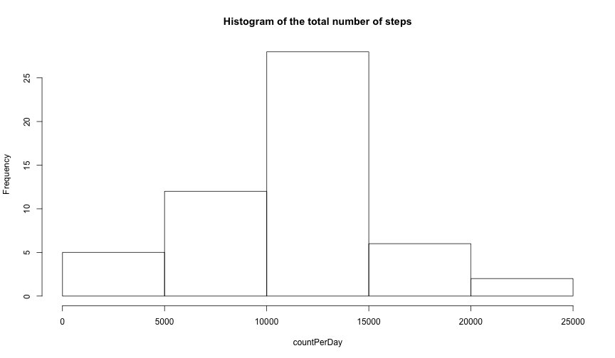
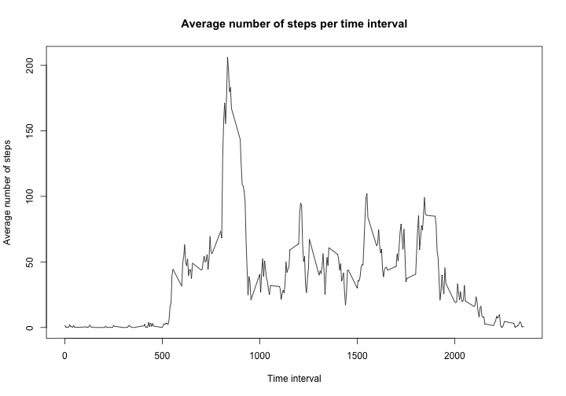
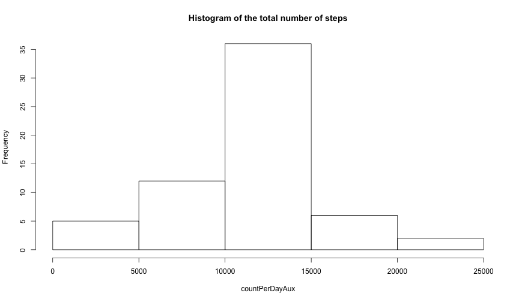
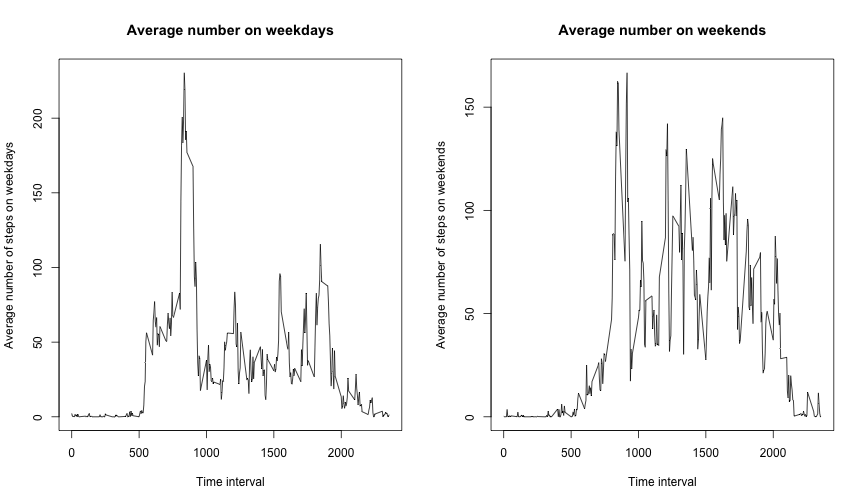

#### Loading and preprocessing the data

Reading the csv data file and casting steps and data variables to number and data format.


```r
file<-"activity.csv"
activity<-read.csv(file, header=TRUE, sep = ",")
steps<-as.numeric(as.character(activity$steps))
activity$steps<-steps
dates<-as.Date(as.character(activity$date))
activity$date<-dates
activityNARemove<-subset(activity, activity$steps != "NA")
```

#### Mean total number of steps per day

Getting the number of steps per day;


```r
countPerDay<-tapply(activityNARemove$steps, activityNARemove$date, sum)
```

Taking the mean and median of total steps per day;


```r
mean(countPerDay)
```

```
## [1] 10766.19
```

```r
median(countPerDay)
```

```
## [1] 10765
```

Making the histogram of the total number of steps taken each day;


```r
hist(countPerDay, main = "Histogram of the total number of steps")
```

 

#### average daily activity pattern

Getting the number of steps taken per time interval.


```r
meanPerInterval<-tapply(activityNARemove$steps, activityNARemove$interval, mean)
```

Making the time series plot of the 5-minute interval (x-axis) and the average number of steps taken, averaged across all days (y-axis)


```r
plot(x = unique(activityNARemove$interval), y = meanPerInterval, main = "Average number of steps per time interval", type = "l", xlab = "Time interval", ylab = "Average number of steps", xlim = c(0, 2355))
```

 

Calculating the interval of maximum average number of steps taken


```r
names(subset(meanPerInterval, meanPerInterval == max(meanPerInterval)))
```

```
## [1] "835"
```

#### Imputing missing values


Couting the number of missing values


```r
sum(is.na(activity$steps))
```

```
## [1] 2304
```


Filling the missing values


```r
activityAux<-read.csv(file, header=TRUE, sep = ",")
steps<-as.numeric(as.character(activityAux$steps))
activityAux$steps<-steps
dates<-as.Date(as.character(activityAux$date))
activityAux$date<-dates
for (i in 1:nrow(activityAux)) {
  if(is.na(activityAux[i, "steps"])) {
    activityAux[i, "steps"]<-meanPerInterval[as.character(activityAux[i, "interval"])]
  }
}
```

Comparing the new data with the previous


```r
countPerDayAux<-tapply(activityAux$steps, activityAux$date, sum)
mean(countPerDayAux)
```

```
## [1] 10766.19
```

```r
median(countPerDayAux)
```

```
## [1] 10766.19
```

```r
hist(countPerDayAux, main = "Histogram of the total number of steps")
```

 


From the results, we can see that histogram and the median changes, but not the mean due to the fact that the missing values appeared in entire days.

#### differences in activity patterns between weekdays and weekends


Creating a new factor variable in the dataset with two levels


```r
for (i in 1:nrow(activityAux)) {
  if(as.POSIXlt(activityAux[i, "date"])$wday == 0 || as.POSIXlt(activityAux[i, "date"])$wday == 6 ) {
    activityAux[i, "weekday"]<-"weekend"
  } else {
    activityAux[i, "weekday"]<-"weekday"
  }
}
```

Making the plots


```r
dataWeekday<-subset(activityAux, activityAux$weekday == "weekday")
meanPerIntervalweekday<-tapply(dataWeekday$steps, dataWeekday$interval, mean)

dataWeekend<-subset(activityAux, activityAux$weekday == "weekend")
meanPerIntervalweekend<-tapply(dataWeekend$steps, dataWeekend$interval, mean)
```


```r
par(mfrow=c(1,2))
plot(x = unique(activityAux$interval), y = meanPerIntervalweekday, main = "Average number on weekdays", type = "l", xlab = "Time interval", ylab = "Average number of steps on weekdays")
plot(x = unique(activityAux$interval), y = meanPerIntervalweekend, main = "Average number on weekends", type = "l", xlab = "Time interval", ylab = "Average number of steps on weekends")
```

 


